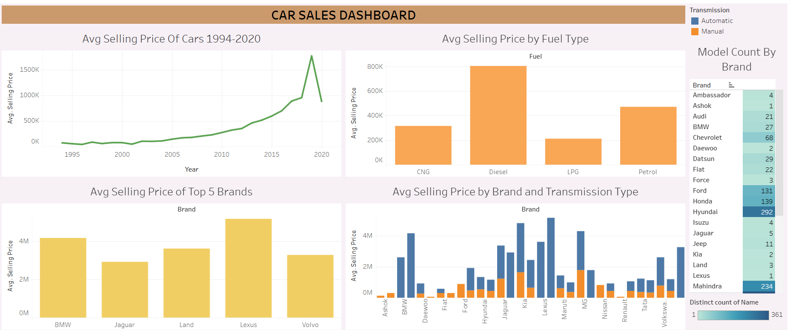

# Car Sales Data Visualization 2.0

# Overview
This Excel file contains visualizations based on a comprehensive dataset of car sales. The charts and graphs within the file offer insights into various aspects of car sales performance, including sales trends, top-selling models, regional distribution, and market share. These visualizations are designed to help users quickly understand key data points, identify patterns, and make informed decisions based on the sales data.

# Visualizations Included (KEY INSIGHTS) 
Sales Trends Over Time:

Line Chart: Displays annual sales trends, helping users observe growth patterns, seasonal variations, and overall performance over time.
Top-Selling Models:

Bar Chart: Highlights the top-selling car models within a specified period, showcasing which models are leading the market.
Regional Sales Distribution:

Stacked Bar Chart: Compares the market share of different car manufacturers by transmission type, providing insight into the competitive landscape.
Customer Demographics:

Pie Chart/Bar Chart: Shows the breakdown of sales by fuel type (e.g., Petrol, LPG, CNG, Diesel) helping to understand customer preferences.

A Table that shoes the Model Count of Car Brands 

# Purpose
This visualization tool is intended for car sales analysts, marketing teams, and business managers who need to derive actionable insights from car sales data. The visualizations are designed to simplify complex data, making it easier to communicate findings and support data-driven decision-making.

